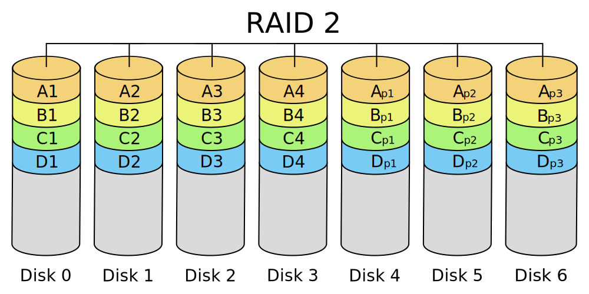
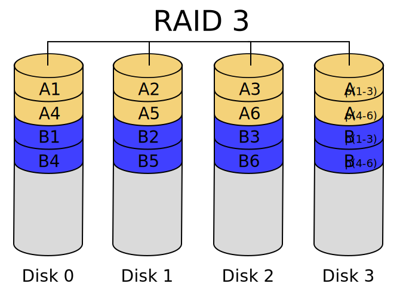
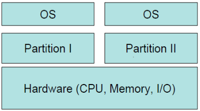
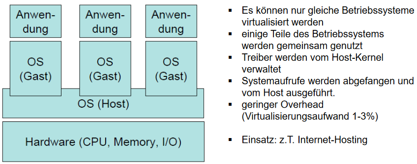
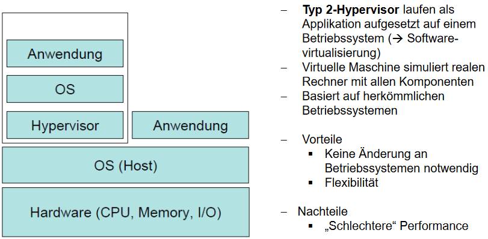
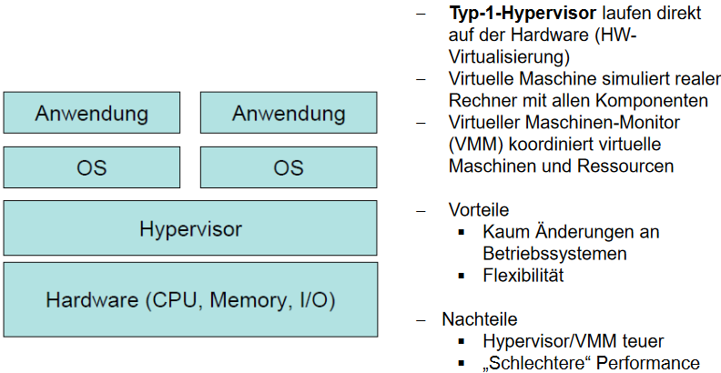
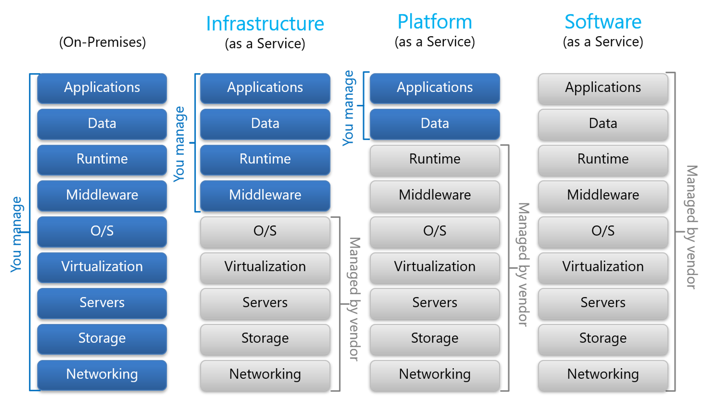

# 1. Prozesse, Threads & Scheduling

## Prozess

-   ist ein Programm in Ausführung
-   OS ist als Menge von Prozessen organisiert (Prozesstabelle)
-   Process-Control-Block (PCB) = Eintrag in Prozesstabelle
-   Einheit der Ressourcenverwaltung
-   Elemente pro Prozess:
    -   logischer Adressraum
    -   Globale Variablen
    -   Geöffnete Dateien, Arbeitsverzeichnis
    -   Elternprozess-ID, Kindprozesse
    -   Signale, verbrauchte CPU-Zeit
    -   Program-Status-Word (PSW)
        -   enthält Status-Bits, CPU-Priorität, Modus (Kernel/User), etc.
    -   Zustand (Running, Blocked, Ready)
-   Scheduler schaltet zwischen Prozessen für Quasi-Parallelität
-   Unterschiedliche Prozesse können auch ohne Problem auf unterschiedlichen Kernen laufen

## Threads

-   "Mini-Prozess": mehrere Threads können (quasi-)parallel auf einem Prozess ausgeführt werden
-   Threads teilen sich den Adressraums des Mutter-Prozesses
-   Einheit der Prozessorzuteilung
-   Elemente pro Thread:
    -   Befehlszähler
    -   Register
    -   Stack
    -   Zustand (Running, Blocked, Ready)
-   Threads können im Benutzer- oder Kernadressraum verwaltet werden
    -   im Benutzeradressraum:
        -   Prozess verwaltet Threads selbst (eigener Scheduler etc.)
        -   funktioniert auch wenn OS keine Threads kennt
        -   schnellerer Thread-Wechsel, da kein Sprung in Kern nötig ist
        -   blockierende Systemaufrufe kann ganzen Prozess blockieren (z.B. bei Page-Fault)
    -   im Kernadressraum (gängiger):
        -   Kern verwaltet eine Thread-Tabelle für alle Threads
        -   OS kann bei blockierenden Systemaufrufen Thread wechseln
        -   höhere Kosten bei Threadwechsel (erst Sprung in Kern)

## Race Conditions

-   Prozesse/Threads wollen gleichzeitig auf die selbe Ressource zugreifen
-   Kritische Regionen = Teile des Programms (bzw. des Speichers), in denen auf gemeinsam genutzte Ressourcen zugegriffen wird
-   Wechselseitiger Ausschluss
    -   Bedingungen
        -   Max. 1 Prozess darf gleichzeitig in kritischer Region sein
        -   Geschwindigkeit / Anzahl der CPU muss ignoriert werden
        -   Prozesse außerhalb der kritischen Regionen dürfen andere Prozesse nicht blockieren
        -   Prozesse müssen in endlicher Zeit in kritische Region kommen können
    -   Verfahren: Interrupts ausschalten
        -   Prozess in kritischer Region schaltet Interrupts aus (auch Timerinterrupt)
        -   kein anderer Prozess kann ausgeführt werden, während der Prozess in der kritischen Region ist
        -   funktioniert nicht bei Multikernprozessoren
        -   I/O ist blockiert
    -   Verfahren: Sperrvariable
        -   Sperrvariable, die anzeigt, ob ein Prozess bereits in kritischer Region ist
        -   Problem: Sperrvariable könnte von 2 Prozessen gleichzeitig gelesen werden
    -   Verfahren: Strikter Wechsel
        -   Sperrvariable, die angibt welcher von x maximalen Prozessen in die kritische Region darf
        -   Problem: Prozess könnte vergessen die Sperrvariable anzupassen und andere blockieren, ohne in kritischer Region zu sein
    -   Verfahren: Lösung von Peterson
        -   Mischung aus Sperrvariable & Striktem Wechsel

## Semaphoren

-   Synchronisationskonstrukt
-   Zählt Anzahl freier Ressourcen
-   Mutex = binärer Semaphor

## Scheduler

-   verwaltet Prozess-Wechsel, also:
    -   Starten & Stoppen von Prozessen
    -   Prozess-Warteschlange
    -   Interrupts
-   Nicht-unterbrechende (nonpreemptive) Strategien (bei Stapelverarbeitung)
-   Unterbrechende (preemptive) Strategien (bei interaktiven Systemen)
-   Prioritätenbasiertes Scheduling
-   Multilevel Scheduling (mehrere Warteschlangen)
-   Berechnung mittlerer Laufzeit: $\frac{1}{n} \cdot \sum{(T_{\text{Prozess-Ankunft}} - T_{\text{Prozess-Ende}})}$

| Strategie                            | unt.?              | Beschreibung                                                                                                                |
| ------------------------------------ | ------------------ | --------------------------------------------------------------------------------------------------------------------------- |
| First Come First Serve (FCFS)        | :x:                | Der Prozess, der mit Status READY am längsten gewartet hat, darf als nächstes rechnen.                                      |
| Shortest Job First (SJF)             | :x:                | Der am kürzesten rechnende Prozess darf als nächstes rechnen. Setzt voraus, dass Laufzeit vorher bekannt ist.               |
| Shortest Remaining Time First (SRTF) | :white_check_mark: | Der Prozess mit der kürzesten verbleibenden Zeit darf als nächstes rechnen. Setzt voraus, dass Laufzeit vorher bekannt ist. |
| Round Robin (RR)                     | :white_check_mark: | Jeder laufende Prozess wird spätestens nach einer a priori bestimmten Zeitspanne (Quantum) unterbrochen und gewechselt.     |

# 2. Deadlock

## Definition

Eine Menge von Prozessen befindet sich in einem Deadlock, wenn jeder Prozess aus der Menge auf ein Ereignis wartet, das nur ein anderer Prozess aus dieser Menge auslösen kann. Meist ist das Ereignis, auf das gewartet wird, die Freigabe einer Ressource. Keiner der Prozesse wird jemals wieder aufwachen.

## Bedingungen

-   Wechselseitiger Ausschluss
    -   Jede Ressource kann zu einem Zeitpunkt max. einem Prozess zugeordnet sein
-   Hold-and-Wait
    -   Prozesse, die schon Ressourcen reserviert haben, können noch weitere Ressourcen anfordern
-   Ununterbrechbarkeit
    -   Ressourcen, die einem Prozess bewilligt wurden, können diesem nicht gewaltsam wieder entzogen werden. Der Prozess muss sie explizit freigeben (anders als z.B. CPU, die via Interrupts entzogen wird)
-   Zyklisches Warten
    -   Es muss eine zyklische Liste/Kette von Prozessen geben, von denen jeder auf eine Ressource wartet, die dem nächsten Prozess in der Kette gehört.

## Graphen-Modell

-   Prozess = Kreis
-   Ressource = Quadrat
-   Pfeil von Ressource auf Prozess = Ressource ist von dem Prozess belegt
-   Pfeil von Prozess auf Ressource = Prozess fordert Ressource an & wartet ggf. bis sie frei wird
-   Zyklus im Graph -> Deadlock

## Matrix-Modell

-   Matrix-Modell wird zur Erkennung von Deadlocks verwendet
-   _Process-Vector_ $P = (P_1,P_2,\dots,P_n)$
-   _Existing-Resource-Vector_ $E = (E_1,E_2,\dots,E_n)$
-   _Available-Resource-Vector_ $A = (A_1,A_2,\dots,A_n)$
-   _Current-Allocation-Matrix_ $C$ (Belegungsmatrix)
-   _Request-Matrix_ R (Anforderungsmatrix)

Es gelten:

$$
C = P \times E =
\begin{bmatrix}
	C_{1,1} & C_{1,2} & C_{1,3} & \dots & C_{1,m} \\
	C_{2,1} & C_{2,2} & C_{2,3} & \dots & C_{2,m} \\
	\vdots & \vdots& \vdots& \ddots & \vdots \\
	C_{n,1} & C_{n,2} & C_{n,3} & \dots & C_{n,m} \\
\end{bmatrix}
$$

und

$$
R = P \times A =
\begin{bmatrix}
	R_{1,1} & R_{1,2} & R_{1,3} & \dots & R_{1,m} \\
	R_{2,1} & R_{2,2} & R_{2,3} & \dots & R_{2,m} \\
	\vdots & \vdots& \vdots& \ddots & \vdots \\
	R_{n,1} & R_{n,2} & R_{n,3} & \dots & R_{n,m} \\
\end{bmatrix}
$$

wobei die Zeile $i$ der Matrizen jeweils die belegten bzw. angeforderten Ressourcen von Prozess $i$ zeigt.

Um einen Deadlock zu erkennen, vergleicht man jede Zeile von $R$ mit $A$. Wenn es möglich ist, eine Zeile in $R$ zu finden, die mit $A$ erfüllt werden kann, so kann dieser Prozess als nächstes ausgeführt werden. Ist es dann möglich, die anderen Prozesse auszuführen, liegt kein Deadlock vor.

## Behebung von Deadlocks

-   Temporärer Entzug einer Ressource (oft nur manuell möglich wenn überhaupt)
-   Rücksetzen eines Prozesses (Voraussetzung: Prozess-Zustand wurde regelmäßig (in einer Datei) zwischengespeichert)
-   Abbruch eines Prozesses

## Vermeidung von Deadlocks

-   Banker's Algorithm
    -   Ressourcen-Anforderungen werden blockiert, wenn das System danach nicht in einem _sicheren_ Zustand wäre
    -   _sicherer_ Zustand heißt, dass selbst wenn alle Prozesse alle sofort die maximalen Ressourcenanforderungen stellen, ein Deadlock trotzdem per Scheduling verhindert werden kann
    -   OS muss die maximalen zukünftigen Ressourcenanforderungen aller Prozesse kennen (meist nicht der Fall)
    -   sehr restriktiv
-   Vermeidung der 4 Bedingungen (oft nicht möglich/schwierig)

# 3. Speicherverwaltung

-   Transienter Speicher: flüchtig, geht beim Ausschalten verloren
-   Persistenter Speicher: Daten stehen auch nach Ausschalten noch zur Verfügung

## Speicher-Hierachie:

| Name            | Zugriffszeit | Kapazität |
| --------------- | ------------ | --------- |
| Register        | ~1ns         | <1kB      |
| Caches          | ~2ns         | ~4MB      |
| Arbeitsspeicher | ~10ns        | ~16GB     |
| Festplatte      | ~10ms        | ~500GB    |
| Magnetband      | ~100s        | <15TB     |

## Swapping & Adressräume

-   Swapping = Verschieben von Daten auf andere Datenträger, besonders um wieder Speicherkapazität zu gewinnen
-   Swap-Partition
    -   ausgelagerte Seiten werden in speziellen Bereich auf Festplatte geschrieben
    -   Ordner bei Unix, große Datei bei Windows
-   Adressraum
    -   abstrahiert physischen Speicher zu virtuellen Adressen
    -   damit können mehrere Programme leicht und effizient im selben Speicher leben, ohne sich zu beeinflussen
    -   jeder Prozess hat seinen eigenen Adressraum
    -   CPU hat Basis- & Limit-Register
        -   Basis-Register hält die untere Grenze des physischen Speichers des Prozesses
        -   Limi-Register hält die obere Grenze des physischen Speichers des Prozesses
        -   ermöglicht dynamische Relokation
-   Fragmentierung durch Swapping
    -   Relokation eines Prozesses auf die Festplatte fragmentiert den Speicher
    -   Lösung: Prozessen gleichgroße Blöcke an Speicher geben
    -   Deswegen wachsen Stack & Heap auf einander zu, damit die Lücke in dem Block an Speicher ist

## Speicherverwaltung

-   mit Bitmaps
    -   Unterteilung des Speichers in Belegungseinheite
    -   jede Einheit ist nur einige KB groß
    -   für jede Einheit gibt es ein Bit in der Bitmap mit 0=frei & 1=belegt
-   mit verketteten Listen
    -   Jedes Element in der Liste enthält ein Speichersegment
    -   Zum Segment werden Start-Adresse und Länge des Segments gespeichert
    -   Auch wird gespeichert ob das Segment frei oder belegt ist
-   Suchalgorithmen:
    -   First Fit
    -   Next Fit
    -   Best Fit

## Virtueller Speicher & Paging

Adressraums eines Prozesses wird in Pages aufgeteilt. Pages sind aneinander angrenzende Bereiche von Adressen und werden dem physikalischen Speicher zugeordnet. Damit muss nicht mehr der ganze Speicher des Prozesses im Hauptspeicher liegen, sondern nur die gerade benötigten Pages.

-   Page = Block im virtuellen Adressraum
-   Page Frame = Block im physischen Adressraum
-   An einer Seite sind folgende Status-Bits vorhanden:
    -   P-Bit: Ist die Seite im Speicher präsent?
    -   R-Bit: Wird die Seite noch referenziert?
    -   M-Bit: Wurde die Seite im letzten Zyklus modifiziert?
-   Page-Table
    -   bildet virtuelle Seitennummer auf Seitenrahmennummern ab
    -   wird vom OS verwaltet
    -   wird von der MMU benutzt
    -   gilt immer nur pro Prozess
    -   bei Prozesswechsel wird auch Seitentabelle getauscht
-   Multilevel Page Table
    -   damit können sehr große virtuelle Adressräume realisiert werden
-   Da oft nicht genug Speicher für alle Prozesse existiert, ist Swapping auch in Paging-Systemen notwendig

### MMU

-   MMU = Memory Management Unit
-   in Hardware implementiert als Teil der CPU implementiert
-   nutzt Seitentabelle, um virtuelle Adressen in physische Adressen zu übersetzen
-   TLB = Translation Lookaside Buffer
    -   Cache der MMU
    -   speichert das Ergebnis der Adress-Übersetzung
    -   wird bei CISC-Prozessoren von der MMU verwaltet
    -   wird bei RISC-Prozessoren vom OS verwaltet

#### Page Fault

1. tritt auf wenn Seite ausgelagert ist
2. MMU löst Systemaufruf aus
3. OS ermittelt Grund der Ausnahme
    - Bei Schutzverletzung wird Prozess abgebrochen
4. OS tauscht ausgelagerte Seite mit eine anderen im Arbeitsspeicher
5. OS ändert Seitentabelle (+ TLB-Flush)
6. OS führt unterbrochenen Befehl erneut aus

### Seitenersetzungs-Algorithmen

-   _Not Recently Used (NRU)_
    -   Entfernt eine zufällige Seite aus der niedrigsten nicht-leeren Prioritätsklasse (no-ref/no-mod < no-ref/mod < ref/no-mod < ref/mod).
    -   Einfach, aber in vielen Fällen nicht ausreichend
-   _First in first out (FIFO)_
    -   Verdrängt die Seite, die am längsten im Hauptspeicher ist.
    -   Einfach & schnell.
    -   Zugriffsverhalten wird ignoriert und daher nur selten eingesetzt.
    -   _Second Chance_
        -   Variante von FIFO, bei der die älteste Seite verdrängt wird, auf die seit dem letzten Seitenwechsel nicht zugegriffen wurde
    -   _Clock_
        -   Seiten werden in einem Ringbuffer gehalten
        -   Eine effizientere Implementierung von Second Chance
-   _Least Recently Used (LRU)_
    -   Verdrängt die Seite, die am längsten nicht benutzt wurde
    -   Umsetzung über eine verkettete Liste und guten Algorithmus
    -   sehr effektiv, aber schwierig zu implementieren & nicht unbedingt effizient
    -   _Not Frequently Used (NFU)_
        -   Software-Implementierung von LRU
        -   Zähler bei jeder Seite, der bei jedem Timer-Interrupt hochgezählt wird, falls die Seite referenziert wird (quasi `add R-Bit`)
        -   Seite mit dem niedrigsten Zähler wird ersetzt
        -   _Aging_
            -   Optimierung von NFU
            -   Zähler wird erst ein Bit nach rechts geschoben, bevor R-Bit zum höchstwertigsten Bit addiert wird
            -   Der Zähler verringert sich über die Zeit also
            -   effiziente Annäherung an LRU
-   _Working Set (WS)_
    -   versucht Seiten des Working-Sets nicht auszulagern
    -   berechnet dafür das Alter der Seite (virtuelle Zeit - Zeitpunkt des letzten Zugriffs)
    -   _WS-Clock_
        -   Mischung aus Working Set & Clock
        -   weit verbreitet

### Entwurfskriterien für Paging

-   Zuteilungsstrategien
    -   lokal
        -   nur Seiten des selben Prozesses werden ausgelagert
        -   führt bei wachsendem Speicher zu mehr Seitenfehlern (Trashing)
    -   Global
        -   auch Seiten anderer Prozesse werde ausgelagert
        -   dynamische Speicherbereiche
-   Lokalitätseigenschaft
    -   Demand Paging
        -   Seiten werden erst eingelagert, wenn sie gebraucht werden
        -   kann v.a. beim Start eines Programms lange Wartezeiten erzeugen
    -   Prepaging
        -   Seiten, die vermutlich demnächst benötigt werden, werden geladen bevor der Prozess sie braucht
        -   welche Seiten werden bald benötigt? -> Working Set

# 4. Dateiverwaltung & I/O

-   Datei: Abstraktion von persistent gespeicherten Daten
-   OS verwaltet Dateien
    -   Name & Pfad
    -   Zugriff & Schutz
    -   Zeitfelder (z.B. letzte Änderung)
    -   Flags (z.B. temporary-flag - würde Datei bei Prozessende löschen)
-   heutzutage auch random access
    -   man kann ab beliebiger Stelle anfangen die Datei zu lesen
-   Dateiorganisation via Ordner

## Datenträger-Layout

-   in Partitionen geteilt
-   Master Boot Record (MBE)
    -   wird beim Systemstart vom BIOS gelesen & ausgeführt
-   Partition
    -   beginnt mit einem Boot-Block
        -   Boot-Block enthält Program zum Laden des Betriebssystems
    -   enthält Dateien & Ordner
    -   enthält Verwaltungsdaten (I-Nodes, Wurzelverzeichnis, etc.)
-   Verwaltung freier Blöcke
    -   Verkettete Liste
    -   Bitmap

## Dateien

-   Dateien werden in Blöcken fixer Größen gespeichert - verhindertt Fragmentierung
-   File Allocation Table (FAT)
    -   Blöcke einer Datei werden als verkettete Liste gespeichert
    -   Reservierter Speicher für FAT hängt von der Plattengröße ab
-   I-Node = Index-Node
    -   jeder Datei wird ein I-Node zugewiesen
    -   listet Attribute und Plattenadresse der Blöcke der Datei
    -   Reservierter Speicher für I-Nodes hängt von Anzahl der geöffneten Dateien ab (weil I-Node nur im Speicher sein muss, wenn Datei geöffnet ist)
    -   Hierachie von I-Nodes bei großen Dateien

## Verzeichnisse

-   Log-Structured File Systems (LFS)
    -   Platte als Log strukturiert
    -   Gesammelt & Gebündelte Schreibaufträge
    -   schnell bei Screibzugriffen mit kleinen Blöcken
    -   inkompatibel mit existierenden Dateisystemen -> wenig verbreitet
-   Journaling File System (FJS)
    -   Geplante Operationen werden erst geloggt und dann durchgeführt

## I/O

-   block devices
    -   Daten werden in Blöcken fixer Größe abgespeichert
-   character devices
    -   Kommunikation über Zeichenströme
    -   Nicht adressierbar (i.e. kein Random Access)
-   Controller
    -   spezielle Hardware oft mit eigenem Mikroprozessor
    -   steuert Gerät weitgehend autonom -> kann Interrupts melden
    -   bietet vereinfachte Schnittstelle fürs Gerät
-   Kommunikation mit Kontrollregistern von Controllern
    -   Buffers
    -   I/O Port Number
    -   Memory Mapped I/O
-   Direct Memory Access (DMA)

### Software mit I/O

-   Anforderung an I/O-Software: Geräteunabhängigkeit

-   Programmierte I/O
    -   manuell programmiertes Warten auf I/O Inputs
    -   busy-wait -> CPU blockiert mit Warten
-   Interrupt-gesteuerte I/O
    -   Interrupts werden bei Eingaben gesendet, um Prozess auf Input aufmerksam zu machen
    -   v.a. sinnvoll bei langsamerer I/O
-   DMA-basierte I/O
    -   DMA-Controller koordiniert Datenübertragung direkt
    -   Keine CPU-Belastung
    -   v.a. sinnvoll bei Übertragung großer Datenblöcke
    -

## RAID

-   Raid = Redundant Array of Inexpensive Disks
-   Idee: Parallelverarbeitung bei Festplatten für bessere Performanz
-   in Praxis nur RAID-Level 0, 1 und 5 verwendet

| Betrieb                 | RAID 0                 | RAID 1                            | RAID 5                  |
| ----------------------- | ---------------------- | --------------------------------- | ----------------------- |
| Redundanz               | nein                   | ja                                | ja                      |
| min. Datenträger        | 2                      | 2                                 | 3                       |
| Rechenaufwand           | sehr gering            | sehr gering                       | mittel                  |
| Lesegeschwindigkeit     | ++                     | ++                                | +                       |
| Schreibgeschwindigkeit  | ++                     | +                                 | -                       |
| Datensicherheit         | --                     | ++                                | +                       |
| Speicherkapazität       | +                      | --                                | -                       |
| Datentransferrate       | höher als Einzelplatte | beim Lesen höher als Einzelplatte | abhängig vom Controller |
| Kapazität bei 2 Platten | 2                      | 1                                 | nicht möglich           |
| Kapazität bei 3 Platten | 3                      | nicht möglich                     | 2                       |
| Kapazität bei 4 Platten | 4                      | 2 (kein Standard mehr)            | 3                       |
| Kapazität bei 5 Platten | 5                      | nicht möglich                     | 4                       |

### RAID 0

Ist nicht redundant, sondern verteilt die Daten gleichmäßig auf alle Platten.

-   Data-Striping
-   eig kein RAID, weil Redundanz fehlt

### RAID 1

RAID 1 spiegelt die Daten, schreibt sie also ohne Unterschied auf beide Platten.

-   Mirroring & Duplexing

### RAID 2

Teilt Daten nicht anhand ihrer Sektoren, sondern am Bit. Die Platten und Arme sollen synchron laufen, um optimale Datenraten zu erreichen → wird in der Praxis quasi nicht genutzt.

-   Hamming Code EEC (Error-Correction Codes)

### RAID 3

Aufteilen der Daten anhand von Bytes und Speichern von Prüfsummen auf einer Paritätsplatte. Die Platten müssen auch hier exakt synchronisiert werden. Fällt eine Platte aus, kann sie aus allen anderen neu berechnet werden.

-   Data-Stripin & Parity

### RAID 4

Striping der Daten und Speichern von Prüfsummen auf einer eigenen Platte. Hier ist keine Synchronisierung nötig. Geht eine Platte verloren, können die verlorenen Bytes aus der Paritätsplatte und allen intakten Platten berechnet werden.

-   Data-Striping & Parity

### RAID 5

Wie RAID 4, allerdings werden die Paritätsinformationen über alle Platten verteilt. Die Wiederherstellung ist aufwendig, aber das Schreiben schneller.

-   Data- & Parity-Striping
-   Stripe Set

### RAID 15

Mischung aus RAID 1 & 5. Daten werden gespiegelt (RAID 1) und jede Spiegelung wird auf mehrere Festplatten verteilt (RAID 5). Min. 3 Platten (wie RAID 5) + 3 Platten für Spiegelung benötigt.

# 5. Virtualisierung, Cloud & Security

-   Virtualisierung = Abstraktung physischer IT-Ressourcen
-   Virtualisierung wird auf einem Hostbetriebssystem (dem Host) mithilfe eines Hypervisors ein Gastbetriebssystem (der Guest) betrieben
-   Bei der Servervirtualisierung wird oft auf Partitionierung gesetzt. Dabei wird in jeder Partition eine eigene Betriebssysteminstanz betrieben, die sich die Hardware teilen
-   Arten der Virtualisierung
    -   Hardware-Emulation
    -   Betriebssystemvitualisierung
    -   Systemvirtualisierung mittels Hypervisor
    -   Hardware-Virtualisierung (native / full Virtualisation)
    -   Paravirtualisierung
    -   Anwendungsvirtualisierung
-   Simulation
    -   Simulation imitiert reale Prozesse mit Hilfe von Modellen
-   Emulation
    -   Nachbildung eines Systems in Teilaspekten
    -   Emulator erhält gleiche Eingabe wie reales System und erzielt möglichst die gleichen Ergebnisse

### Vorteile

-   Bessere Ausnutzung der Hardware
-   Vereinfachte Administration
-   Vereinfachte Bereitstellung
-   Erhöhung der Verfügbarkeit
-   Erhähte Sicherheit

### Virtualisierung via Emulation

### Servervirtualisierung via Partitionierung

-   gute physikalische Trennung der einzelnen Systeme
-   keine Performanzverluste durch Hypervisor oder ähnlichem
-   Aufteilung kann nur entlang Modulgrenzen verlaufen

### Betriebssystemvirtualisierung via Container

### Virtualisierung via Hypervisor

-   Hypervisor = Virtual Machine Monitor (VMM)
-   VMM erstellt und verwaltet VMs
-   VMM verteilt physische Ressourcen an VMs

### VM vs Container

-   VMs beinhalten Applikationen & vollständiges OS
    -   Container beinhalten nur notwendige Betriebssystem-Komponenten
-   auf physischem Server laufen i.d.R. mehrere VMs gleichzeitig isoliert von einander
    -   auf einem OS laufen mehrere Container isoliert von einander
-   Hypervisor für VM leben oft in Ring 0 (Kernel-Space)
    -   Container leben im User-Space
-   Container haben höhere Portabilität
-   Container haben weniger Overhead (weil kein VMM benötigt wird)
-   Persistente Datenspeicherung bei Containern ist kompliziert

## Cloud

### Service Modelle

-   IaaS = Infrastructure as a Service
-   PaaS = Platform as a Service
-   SaaS = Software as a Service

### Charakteristika

-   Broad Network Access: Ressourcen sind breitbandig verfügbar
-   Rapid Elasticity: Ressourcen können schnell & bedarfsgerecht skaliert werden
-   Measured Service: Messen des Ressourcenverbrauchs, Abrechnung nach Verbrauch
-   On-demand self-service: Selbstständige Verwaltung der Ressourcen durch Kunden
-   Ressource Pooling: Provider bündelt Ressourcen und stellt sie mehreren Nutzern gleichzeitig zur Verfügung
-   Nutzer werden Mieter
-   Nutzer besitzen keine physische Infrastruktur mehr

## Security

-   Sicherheit
    -   Nicht-technische Anforderung an gesamten Prozess
-   Schutz
    -   technische & organisatorishe Anforderung
    -   hier kann OS was machen
-   Datenschutz
-   symmetrische & asymmetrische Kryptografie

### Sicherheitsziele des OS

1. Vertraulichkeit
    - geheime Daten sollten geheim bleiben
2. Integrität
    - Datenintegrität durch funktionierende Autorisierung
3. Verfügbarkeit
    - System darf nicht durch Störungen unbnutzbar werden
    - Bsp.: Distributed-Denial-of-Service (DDoS)

### Sicherheitsmechanismen - AAA

-   Authentifizierung
    -   Feststellung der Identität
-   Autorisierung
    -   Vergabe von Zugriffsrechten
-   Accounting
    -   Protokollierung von Aktivitäten

### Zugriffskontrolliste

-   ACL = Access Control List
    -   pro Objekt gespeichert
    -   gibt an, welche Subjekte welche Rechte an dem Objekt haben
    -   wird mit betroffenen Objekt gespeichert (z.B. in I-Node der Datei)
    -   erlauben selektiven Entzug von Rechten (Capabilities nicht so einfach)
-   Capability
    -   pro Subjekt gespeichert
    -   speichert Listen, die angeben auf welche Objekte das Subjekt wie zugreifen darf
    -   sind effizienter als ACLs
-   ACLs & Capabilities können gemischt genutzt werden

# 6. Multiprozessorsysteme

-   kommen nur im Multiple Choice Teil der Klausur dran
-   habe ich noch nicht zusamengefasst -- vllt. lsse ich es auch aus :shrug:
