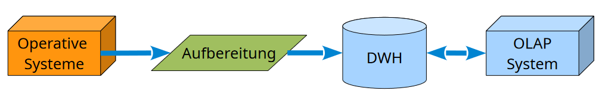
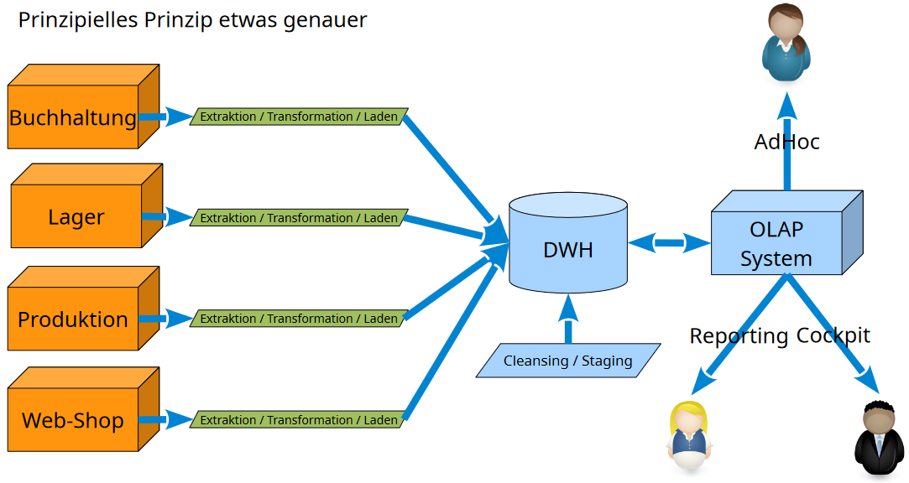
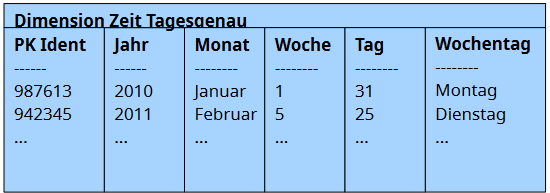
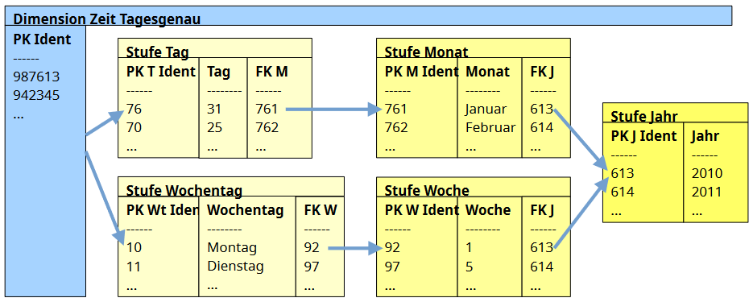
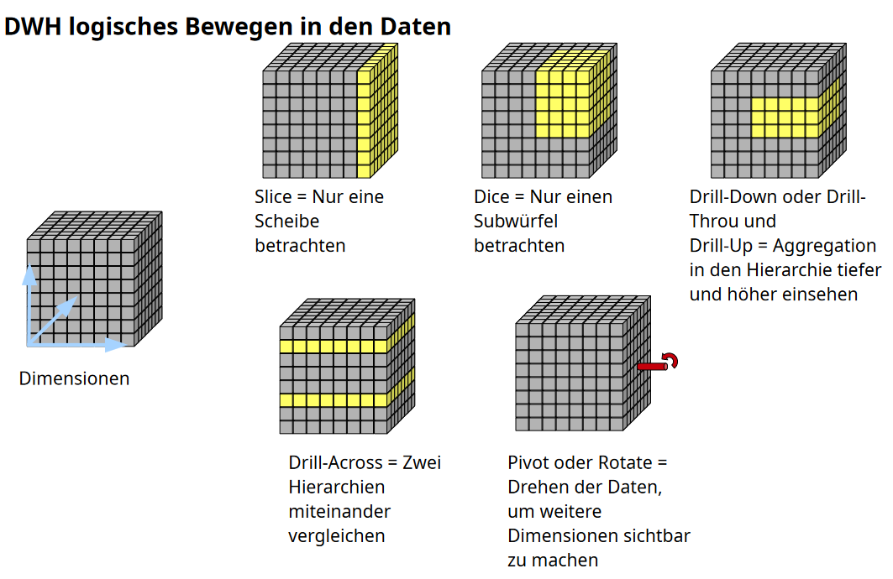

# Data Ware House

-   DWH sowie BI sind Entscheidungsgrundlagen

## FASMI-Regeln

-   Fast
-   Analysis (einfache Analyse möglich)
-   Shared (Mehrbenutzerbetrieb)
-   Multidimensional
-   Information (Daten dürfen in ihrer Transparenz nicht beschränkt werden)

# OLAP

-   OLAP = Online Analytical Processing
-	Dimensionen + Fakten = Datenwürfel
    -   nur im Datenwürfel sind Messdaten -> in den Dimensionen sind (i.d.R.) keine Messdaten
    -   Dimensionen sind immer diskrete Kategorien (z.B. Alter im Sinne von Kind/Teen/Erwachsen/etc.)
    -   Ein Faktum ist die genaue Messung, also einfach eine Zahl
    -   Im Würfel stehen dann nur die Kategorisierungen der Messungen (nicht die genauen Messungen selbst)
        -   in der Praxis ist das nicht immer so streng getrennt
    -   Anders als beim normalen Datenbankmanagement, gibt es bei DWH absichtlich redundante Daten
        -   Hauptgrund dafür ist erhöhte Performanz bei der Datenabfrage
-   ETL (Extraction, Transformation, Loading)

## Ziele

-   verbindet unterschiedliche Datenquellen
-   Aggregation unübersichtlicher Daten (globale Sicht)
-   Ermittlung von Korrelationen
-   Daten-Entwicklungen über Zeit

## Risiken

-   Unvollständige Dimensionen
-   Fehlerhafte Daten
-   Große Lücken in den Faktendaten
-   Kein Single-Point-of-Truth (z.B. Widersprüche in Daten)
-   Datenschutzverletzungen
-   Scheinkorrelation

## Star Schema

-	Jede Dimension wird in einer Tabelle/Objekt zusammengefasst

## Snowflake Schema

-	Jede Hierarchie einer Dimension wird in einer Tabelle/Objekt gehalten

## Datenabfragen

### SQL-Umsetzung

-   Slice: ???
-   Dice: ???
-   Drill-Down: ??
-   Drill-Across: Union

## Transaktionen

-   ACID (Atomic, Consistent, Isolated, Durability)
-   NoSQL + Eventual Consistency
-   CAP (Consistent, Available, Partition tolerance)
    -   Massendatentauglich
    -   Verteilbare Last
    -   Hohe Verfügbarkeit
    -   Konsistenzmanagement ist viel aufwendiger
    -   Schreib-Lese-Konflikte schwieriger zu handhaben
    -   Multiversionen aufwendiger

## ETL

-   Extraction
    -   Regelmäßige Extraktion von Daten aus unterschiedlichsten Quellen
    -   Delta-Extraktion (Nur Veränderungen werden im DWH gespeichert)
-   Transformation
    -   Vereinheitlichung der Datenformate
    -   Daten aus unterschiedliche Quellen zusammenführen
    -   Duplikate entfernen
-   Loading
    -   Laden der Daten; Pufferung möglich
-   Staging-Area
    -   Pufferbereich
    -   Nachverarbeitung möglich
-   Cleansing-Prozess
    -   Temporale Bereinigung
    -   Reduktion von Datenlücken

-   Aufbau nach Map-Reduce Prinzip
-   Alternative Formen
    -   ELT (Transformation erst im DWH)
    -   TEL (Transformation in Datenquelle)

## Logisches Datemodell

-   Detaildaten = Dimensionen, Datenfakten
-   Aggregatsdaten
    -   Welche Daten sollten vor-aggregiert werden?
-   Metadaten
    -   Struktur- und Inhaltsdaten

-   ROLAP
    -   Relational (Basis für DWH ist relationale DB)
    -   relationale DB hält auch Aggregats-/Metadaten vor
    -   mittlere Speicherkapazität für zwischengespeicherte Aggregate
    -   gut für große, strukturierte Daten
-   MOLAP
    -   Multidimensional
    -   gut für kleinere, multidimensionale Daten
    -   schnelles Lesen, langsames Schreiben
    -   Hohe Speicherkapazität -> Multidimensionale Aggregate können gut vorgespeichert werden
-   HOLAP
    -   Hybrid aus ROLAP, MOLAP
    -   Detaildaten in relationaler DB
    -   Aggregats-/Metadaten im MOLAP
    -   Schnelles Lesen für zwischengespeicherte Aggregate
    -   Langsames Lesen
    -   gut für große multidimensionale Daten
-   DOLAP
    -   Desktop-Anwendung (z.B. Excel)
    -   gut für kline Datenmengen
    -   schnelles Lesen (nutzt RAM vom Desktop)
-   Data Lake
    -   Quasi unverändertes Ablegen der Quelldaten
    -   Detail-/Index-/Metadaten zusammen verwaltet
    -   gut für sehr große, unstrukturierte Datenmengen
    -   Datenzugriff über Suchmechanismen (z.B. RegEx)
    -   Schreiben sehr schnell
    -   Lesen nur bei indexierten Daten schnell

## Versionierung

-   Eindutigkeit und Chronologie müssen ermöglicht werden
-   Master-Slave Prinzip

### Temporalisierung
