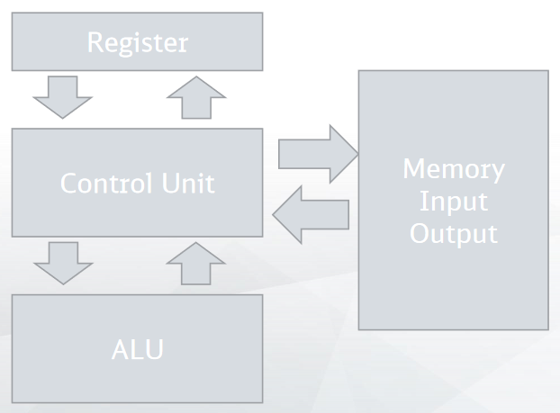
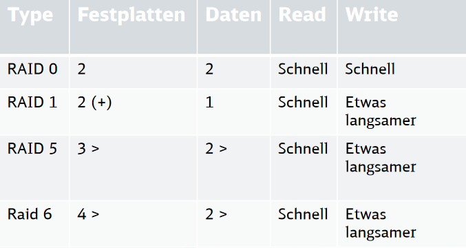

# Zusammenfassung

## Für Klausur

Hier sind Themen verlinkt, bei denen ich mir persönlich gut vorstellen kann, dass sie für die Klausur besonders relevant sein werden.

Praktische Aufgaben:

-   Binäres Rechnen (Plus, Minus, Mal, Geteilt)
-   [Caching](#cache) (Aufgabe wie in der Vorlesung)
-   [Pipeline](#pipelining) (Aufgabe wie in der Vorlesung)

Verständnis Aufgaben:

-   [Architekturen - Von Neumann & Harvard](#architekturen)
-   [Instruction Sets von CPUs](#instruction-sets)
-   [Interrupts & Interrupt-Handling](#interrupt)
-   [DRAM vs SRAM](#dram-vs-sram)
-   [DDR](#ddr)
-   [Persistenter Speicher](#arten-des-persistenten-speichers)
-   [Bus-Interfaces](#bus)

## Architekturen

### Von Neuman Architektur

-   Daten, Code, I/O teilen sich ein Bus-System
-   einfach zu baun
-   Flaschenhals beim geteilten Bus

### Harvard Architektur

-   Daten, Code, I/O haben separate Bus-Systeme
-   Segmentierter Speicher
-   komplexer zu bauen, aber schneller

## Grundstruktur

## CPU

### Instruction Sets

-   CISC (Complex Instruction Set Computing)
    -   früher dominant und normal
    -   große Instruction-Sets (bis zu 1000 Befehle)
    -   4 Arten an Befehlen:
    -   Transport => I/O, Read/Write für Register & Memory
    -   Verarbeitung => ADD, SUB, etc.
    -   Steuerung => Jumps, etc.
    -   CPU Steuerung => Halt, Interrupt, etc.
-   RISC (Reduced Instruction Set Computing)
    -   heute dominant & wachsend
    -   oft schnellere Ausführung der Befehle
        -   v.a. durch CPU-Pipelining, weil die nächsten Befehle gut vorhersehbar sind
    -   Feste Registerlänge
    -   RISC-CPUs haben oft Floating-Point-Units direkt eingebunden (weil weniger Platz für komplexe Mikro-Ops benötigt wird)
    -   bei Untersuchung festgestellt, dass die meisten CISC Befehle fast nie verwendet wurden -> entsprechend wurden sie für RISC entfernt
    -   heutzutage gibt es oft auch einige umfangreichere, komplexe Befehle
    -   Bsp. RISC-CPUs:
        -   ARM
        -   RISC V (neueste Form; mehr oder minder open-source)
        -   Sun's Spark
        -   IBM's PowerPC
        -   moderne Chips von z.B. AMD haben nun oft auch RISC-Kerne
-   VLIW (Very Long Instruction Word)
-   EPIC (Explicitly Parallel Instruction Computing)

### Register

-   Data Register
-   Flag Register (z.B. Carry-/Zero-Flag)
-   Pointer/Adress Register
    -   Program/Instruction Pointer
    -   Stack Pointer
    -   Index Register

#### Adressierungsarten

<!-- @Question is this even important for the exam? -->

Notiz: Instruction Sets bieten meistens nur einige dieser Adressierungsarten als eigene Befehle an

-   Immediate Adressing
    -   lädt bei compile-time bekannten, konstanten Wert
    -   kein Speicherzugriff
-   Direct/Absolute Adressing
    -   lädt Daten aus geg. absoluter Adresse (quasi Dereferenzierung)
-   Extended Adressing
    -   Adresse selbst wird geladen
-   Index Adressing
    -   Base-Pointer + offset gegeben durch index
-   Scaled Index Adressing
    -   wie index-adressing aber mal
-   Register Adressing
    -   lädt Inhalt eines Registers in ein anderes Register
-   Indirect Register Adressing
    <!-- @Question is this description accurate? -->
    -   lädt den über ein Register dereferenzierten Wert in ein weiteres Register

Weitere Adressierungsarten sind auf (Wikipedia)[https://en.wikipedia.org/wiki/Addressing_mode] gut erklärt.

### Ablauf

1. Fetch (via (Instruction)-Bus)
2. Decode
3. Execute (z.B. via ALU/FPU)
4. Write (z.B. in ein Register)

### Cache

Caches werden immer mit SRAM implementiert und sind damit sehr schnell. Es gibt außerdem eine Cache-Hierachie:

1. L1i & L1d für Instruktionen und Daten (L1i ist meist größer als L1d)
2. L2
3. L3
4. heute manchmal auch L4

L1 ist am kleinsten und schnellsten, danach wird jeder Cache größer und langsamer.

-   inklusiver Cache
    -   Wenn L2 inklusiv ist, dann enthält es auch alle Blöcke aus L1
-   exklusiver Cache
    -   Wenn L2 exklusiv ist, dann enthält es keine der Blöcke aus L1

<!-- @Incomplete: There's also "non-inclusive non-exclusive" (NINE) caches, which are neither inclusive or exclusive. To read more on the topic, see here: https://en.wikipedia.org/wiki/Cache_inclusion_policy -->

-   Write-Through
    -   Direkt auf Speichermedium (z.B. RAM) schreiben
-   Write-Back
    -   Hält Daten erstmal nur im Cache

Verdrängungsverfahren

-   FIFO (First-In-First-Out)
-   LRU (Least Recently Used)
-   LFU (Least Frequently Used)
-   Random (geringer Stromverbrauch)
-   CLOCK (wird nach Miss & Zeitwert bewertet - effektiv aber energieverbrauchend)
-   Statistik (Logik innerhalb des Caches - effektiv aber komplexer & teurer)

#### Fully Associative Cache

-   Tag + Block-ID
-   simple & performant
-   keine Konkurrenz zwischen unterschiedlichen Adressen
-   muss groß sein um sinnvoll zu sein -> hohe Kosten

#### Direct Mapped Cache

-   Tag + Line-ID + Block-ID
-   Konkurrenz wenn unterschiedliche Adressen die selbe Line-ID haben -> fragmentierter Speicherzugriff problematisch

#### Set-Associative Cache

-   Wie Direct Mapped Cache, aber mehrere Adressen können pro Line-ID (hier auch Set-ID) gespeichert werden
-   n-way Set-Associative Cache kann n Einträge pro Line-ID speichern

#### Cache-Line Flags

<!-- @Incomplete weil wahrscheinlich unwichtig für Klausur -->

-   v.a. für Multiprozessor-Systeme wichtig.
-   z.B. Dirty-Flag (nicht synchronisiert mit Arbeitsspeicher)
-   z.B. Lock-Flag (darf nicht aus Cache verdrängt/geflusht werden)

### Alignment

Compiler legt Variablen zu Beginn des Programms, damit Variablen möglichst in unterschiedliche Cache-Lines fallen (und sich nicht gegenseitig rauswerfen).

Datenstrukturen können mit Padding auf bestimmte Byte-Größen erweitert werden. Der Vorteil davon ist, ass Datensätze Cache-Lines ausfüllen -> ein Datensatz muss nicht über zwei Cache-Lines verteilt werden

<!-- @Incomplete: There's many more reasons for wy alignment is beneficial, that aren't important to know for the exam, though -->

### Pipelining

Ohne Pipeline wird der nächste Befehl erst geladen (Fetch), wenn der vorherige fertig durchgelaufen ist (Execute & Write). Bei Pipelining wird die Ausführung der nächsten Befehle bereits angefangen, bevor der vorherige Befehl fertig ausgeführt wurde. Damit werden alle Bestandteile der CPU jederzeit genutzt und die Performanz enorm verbessert.

Dieses Pipelining ist allerdings nicht immer möglich. Dann gibt es einen Pipeline-Stall, d.h. mit dem Ausführen der nächsten Befehle wird gewartet, bis ein vorheriger Befehl fertig ist. Es gibt die folgenden Probleme beim Pipelining:

-   Strukturkonflikt
    -   Eine Komponente wird von mehreren Befehlen gleichzeitig gebraucht (z.B. Befehl 1 nutzt FPU und Befehl 2 will im gleichen Zyklus auch die FPU nutzen)
-   Datenkonflikt
    -   Ein Befehl benötigt das Ergebnis eines vorhergehenden Befehls
-   Steuerunskonflik
    -   Jumps / Interrupts wurden falsch vorhergesagt und berechnete Ergebnisse des falschen Branches müssen verworfen werden (in kurz: Pipeline-Flush durch Branch-Misprediction)

Um diese Konflikte zu vermeiden, werden Instruktionen oft _out-of-order_ ausgeführt. Dafür unterscheidet man folgende Beziehungen zwischen Befehlen:

-   RAR (Read-After-Read)
    -   beide Befehle lesen die selben, unveränderten Daten -> kein Konflikt
-   RAW (Read-After-Write)
    -   Befehl 2 benötigt Ergebnis von Befehl 1 -> Pipeline Stall
-   WAR (Write-After-Read)
    -   kein Konflikt solange sicher gestellt werden kann, dass das Schreiben nach dem Lesen ausgeführ wird (bei parallelisierten Pipelines nicht unbedingt möglich)
-   WAW (Write-After-Write)
    -   selbe Problematik wie bei WAR

### Prefetching

Damit übers Pipelining mehrere Befehle gleichzitig abgehandelt werden können, müssen die nächsten Instruktionen bereits vorgeladen werden. Auch muss die CPU dafür spekulativ die nächsten Daten laden.

Das Prefetching kann damit aber den Cache auch mit nicht benötigten Daten füllen. Jedoch kann auch die sehr lange Lesezeit von Daten und Instruktionen während der Bearbeitung vorheriger Befehle abgewartet werden, damit die CPU ideal ausgenutzt werden kann und idealerweise niemals auf Daten/Instruktionen warten muss.

### Branch Prediction

Bei Jump-Befehlen (if/else, loops) muss die CPU spekulieren welche Instruktionen als nächste ausgeführt werden. Diese Spekulation heißt Branch Prediction.

Branch-Misprediction führt zu [Pipeline-Stalls](#pipelining).

### Interrupt

2 Arten an Interrupts:

-   Maskable
-   Non-Maskable
    -   nur Non-Maskable kann vom Programm unterdrückt und ignoriert werden.

Interrupt-Handling:

1. Register (inkl. Pointer, Flags) werden auf Stack gespeichert
2. Program springt zum Interrupt-Vektor / Interrupt Service Routine (ISR), also die Adresse an der der Programmcode für die Abhandlung des Interrupts steht
3. Register (inkl. Pointer, Flags) werden aus dem Stack zurückgeschrieben -> Programm läuft weiter

<!-- @Note: Auf den Folien wird der Heap zum Zwischenspeichern der Register genannt. Das ist falsch (und komplett unsinnnig), stattdessen werden alle Register auf dem Stack zwischengespeichert. Quellen: https://tldp.org/LDP/lkmpg/2.6/html/x1256.html, https://www.felixcloutier.com/x86/iret:iretd:iretq -->

## Speicher

Speicher-Hierachie:

1. [Register](#register)
2. [Caches](#cache)
3. [Arbeitsspeicher / RAM](#ram-flüchtiger-speicher)
4. [Festplatte](#arten-des-persistenten-speichers)

### RAM (Flüchtiger Speicher)

#### DRAM vs SRAM

-   SRAM = Statischer RAM
-   DRAM = Dynamischer RAM

-   Transistoren (teuer, Strom- & Platzverbrauch)
    -   DRAM braucht 1
    -   SRAM braucht 6
-   SRAM ist schneller
-   DRAM nutzt Kondensator zur Speicherung
    -   verliert jederzeit ein wenig Spannung, weswegen er immer wieder refresht werden muss
    -   stromsparender als SRAM
-   Adressierung
    -   DRAM: Erst die Reihe adressieren, dann die Spalte addressieren
    -   SRAM: Direkt die ganze Adresse
-   SRAM wird bei Caches, DRAM beim Arbeitsspeicher verwendet

#### DDR

-   DDR = Double Data Rate
-   Bei DDR1 werden Bits bei auf- & absteigender Spannung übertragen
-   Bei DDR5 gibt es bereits 16 Bits pro Flanke
-   DDR ist damit sehr viel schneller
-   DDR5 hat auch mehr Zeit zwischen Refreshes
-   Prefetch kann damit auch erhöht werden

### Arten des persistenten Speichers

<!-- @Note: Kenne mich nicht so gut mit dem Zeug hier aus, deswegen ist das mehr eine Auflistung der Namen aus den Folien -->

-   ROM = Read-Only-Memory
    -   früher z.B. fürs BIOS verwendet
-   PROM = Programmable ROM
-   EPROM = Erasable PROM
    -   Daten können mit starkem UV-Licht gelöscht werden
-   EEPROM = Electrically EPROM
    -   Daten können Bit-weise elektrisch geschrieben und gelöscht werden
-   Flash-Speicher
    -   lässt sich schnell in Blöcken auslesen
    -   modernere Alternative zu EEPROM
    -   begrenzte Lebensdauer
    -   NAND-Flash-Speicher -> nicht linear adressierbarer Speicher
    -   NOR-Flash-Speicher -> linear addressierbarer Speicher
-   PLD = Programmable Logic Device
    -   ROM als AND-Matrix und OR-Matrix verstanden
    -   OR-Matrix ist frei programmierbar
-   PAL = Programmable Arrays Logic
    -   können nur einmal programmiert werden
-   GAL = Generaic Arrays Logic
    -   kann umbeschrieben werden
-   PLA
    -   AND- & OR-Matrix sing bide beschreibbar
-   CPLD = Complex Programmable Logic Device
    -   hat zusätzlich I/O Block, komplexere Hardware, Flip-Flops
-   FPGA = Field Programmable Gate Array
    -   komplexe Schaltung als Hardware, die programmiert werden kann
-   ASIC
    -   Masken-programmierte Logik-Schaltungen
    -   ermöglicht die Implementierung komplexer Algorithmen in Hardware
-   Disketten
-   Tape-Drives
-   MFM Festplatten (heute ausgestorben)
-   SSD = Solid-State-Drive
    -   in Blöcken organisiert -> bei Änderung eines Bits, muss der ganze Block muss neu geschrieben werden
-

Wichtige Kennzahl: IOPS

-   Wie viele I/O Operationen kann das Medium durchführen
-   wird sequenziell oder random zugegriffen?
-   Read oder Write?
-   besonders viele kleine Dateien können schnell IOPS verbrauchen

<!-- @Question: Is it correct what I wrote here - especially with FPGAs, ASICs I'm quite unsure -->

### RAID

<!-- @Incomplete: a slightly more detailed description might be nice here -->

### Bus

Arten an Hardware-Bussen:

-   Steuerbus (steuert Komponenten wie RAM)
-   Adressbus (unidirektionales Ansprechen von Adressbereichen)
-   Datenbus (bidirektionale Übertragung von Daten)

Bus-Interfaces

-   ATA
-   SATA = Serial ATA
    -   in Kombination mit PCI-Express ist es leichter zu benutzen & schneller als ATA
-   Parallel SCSI (heute ausgestorben)
-   SAS = Serial Attached SCSI
-   PCI = Peripheral Component Interface
-   SPI = Serial Peripheral Interface
-   Thunderbolt
    -   zur Anbindung performanter Hardware wie GPUs
-   USB = Universal Serial Bus
-   RS-232
    -   sehr alter Standard für serielle Schnittstellen
-   I2C = Inter-Integrated Circuit
    -   noch immer verbreiteter Standard zur Kommunikation
