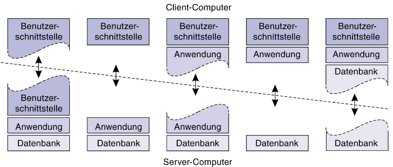

## Verteilte Syteme

- Definition:
  > Viele unabhängige Computer, die wie ein einzelnes (kohärentes) System erscheinen

- Erhöhte Skalierbarkeit (vertikale Skalierung)
- Bessere Ausfallsicherheit
- Verbirgt internen Aufbau des Systems (Black Box)
- (Ggf. billiger)

### Ziele

- Leichter Zugriff auf Ressourcen
- Verteilungstransparenz
  - Interner Aufbau verborgen
  - Ortstransparenz (Ressourcen können sich an unterschiedlichen Orten befinden)
  - Zugriffsarten auf Ressourcen verborgen
  - Migrationstransparenz (Ressourcen können verschoben werden)
  - Relokation (Migration während Zugriff / Betriebs) von Ressourcen verborgen
  - Replikation (Ressourcen können mehrfach existieren) von Ressourcen verbogen
  - Nebenläufigkeitstransparenz (verbirgt, dass mehrere Prozesse / Anwender auf eine Ressource gleichzeitig zugreifen)
  - Fehlertransparenz (Ausfall einer Ressource verborgen)
- Skalierbarkeit
- Offenheit
  - Richtig, vollständig & neutral spezifiziert
  - Interoperabilität = Zusammenarbeit mit anderen Services (basierend auf Schnittstelle)
  - Portabilität = Läuft auf unterschiedlichen Platformen (basierend auf Schnittstelle)

## System-Architektur

- Zentral vs. Dezentral
- Client-Server: 3 Schichten

- 2-Tier Architektur: Client-Server
- 3-Tier Architektur: Client-Server-Server
  - n-Tier Architektur: Client-Server-Server-...-Server
  - letzter Server kann z.B. eine Datenbank sein
- Client-Server-Server (mittlerer Server = Middleware Server)
  - Proxy = Vertritt Server + Caching
  - Trader = Auswahl geeigneten Servers
  - Balancer = Auslastung verteilen (Load Balancer)
  - Koordinator = Koordiniert verschiedene Services
  - Agent = Koordinator + Agent bestimmt welche Services aufgerufen werden
  - Broker
  - Filter (z.B. Webfilter)

## Zustandlos vs. Zustandsbehafteter Server

- Zustandsloser Server
  - Speichert keine Zustandsinfos der Clients
  - Bsp.: Webserver (HTTP(S))
  - Protokollierung für Optimierung / Fehlersuche möglich
- Zustandsbehafteter Server
  - Speichert Zustandsinfos der Clients
  - Bsp.: Dateiserver
  - Vorteil: Leistungsverbesserung
  - Nachteile:
  - Andere Server können bei Ausfall/Überlastung nicht einspringen
  - Lifecycle-Management der Zustandsinfos (Komplexität):
   - Wann werden sie gelöscht?
   - Wie werden sie für andere Nodes verfügbar gemacht?

## Code-/Prozess-Migration

- Code-Migration
  - Code wird von einer Maschine zu einer anderen migriert
  - Gründe:
  - Minimierung der Kommunikation
    - z.B. Code-Migration von Server zu Client, um nötige Netzwerkanfragen zu reduzieren
  - Leistungsoptimierung
  - Parallelverarbeitung
  - Austausch von zugrundeliegenden Ressourcen (Hardwareupgrade, Betriebsystemwechsel)
  - Flexibilität
    - z.B.: Client erhält Code erst nach Registrierung
- Prozess-Migration
  - Prozess (d.h. Code, Daten (Stack, Pointer etc.), ggf. weitere Ressourcen) werden migriert
  - Gründe:
    - Last-Verteilung
    - Leistungssteigerung (Optimierung der Rechenzeit)
    - Flexibilität, die Ressourcen zu nutzen, die gerade verfügbar und am Besten geeignet sind
  - Herausforderungen:
    - alles muss migriert werden (z.B. Register, Stack, Heap, etc.)
    - neue Umgebung muss sehr ähnlich sein (z.B. gleiche CPU-Architektur, OS etc.)
    - Prozess darf nicht in kritischer Phase sein (z.B. bei Dateizugriff)
- Mobilität
  - schwach = Code/Prozess wird vor Ausführungsstart migriert (einfacher)
   - nahe an Code-Migration
  - stark = Code/Prozess wird während Ausführung migriert
    - Anhalten -> Verschieben des Prozesses -> Fortsetzen
    - Register, Stack, Heap, etc. müssen alle migriert werden
- Initiierung
  - Senderinitiiert
   - Client sendet Code an Server
   - hohes Sicherheitsrisiko
  - Empfängerinitiiert
   - Initiatve durch Zielcomputer
   - z.B. im Kontext eines Webbrowser

- Problem: Ressourcenmanagement
- Heterogene Systeme erfordern hohe Portabilität des Codes
- Prozessmigration ist in der Praxis fast unmöglich

## Virtualisierung

- Nachahmung eines Systems über Einhaltung der Schnittstelle
- Erhöht Portabilität (über Reduktion von Unterschiedlichkeit)
- kann Sicherheit erhöhen (über Isolation)
- Containervirtualisierung zur Isolierung von Prozessen
- macht SysAdmins das Leben leichter (z.B. durch einfache Installation / Tests von Software)

## Kommunikation

- Unicast = Senden an ein Ziel
- Anycast = Senden an ein Ziel aus einer Gruppe von Zielen (oft nächstgelegene Ziel)
- Broadcast = Senden an alle Ziele
- Multicast = Senden an eine Gruppe von Zielen

- Dienstgüte
  - Bandbreite
  - Übertragungsverzögerung (Latenz)
  - Jitter (Schwankung der Latenz)
  - Verlustrate

- Persistent
  - Middleware speichert Nachricht bis sie beim Empfänger ankommt
  - Konzeptuell eine Nachrichtenwarteschlangen
  - Bsp.: Email
- Flüchtig
  - Nachricht nur gespeichert solange sendende & empfangene Anwendung laufen
  - Bsp.: Berkley Sockets
- Diskret
  - Jede Nachricht ist eine vollständige Kommunikationseinheit
  - Bsp.: Bilder, ausführbare Dateien
- Fließend
  - Senden vieler Nachrichten mit relevanter Reihenfolge
  - Bsp.: Livestream
- Synchron
  - Sender wartet bis Nachricht empfangen (von Middleware/Server) oder bis Antwort gekommen ist
  - Reihenfolge der Nachrichten bleibt gleich
- Asynchron
  - Sender setzt fort nach Absenden der Nachricht
  - Reihenfolge der Nachrichten kann abweichen
- Isochron
  - Reihenfolge irrelevant, Nachrichten müssen jedoch zu einem gewissen Zeitpunkt (TTL) ankommen

## Remote Procedure Call (RPC)

- Aufruf einer Funktion auf einer anderen Maschine
- Langsamer
- Daten können nicht per Referenz übergeben werden
- Daten müssen serialisiert werden
- Problem der gleichen Datenbehandlung
  - z.B. Little-Endian vs. Big-Endian

### Fehlerumgang

- Umgang nach Serverabsturz nach Erhalt des RPC
  - Mindestens einmal erneut versuchen
  - Höchstens einmal erneut versuchen
  - Keine Garantie - 0 bis n-mal erneut versuchen
- Falls Antwort des Servers nicht ankommt
  - Erneut versuchen
    - nur wenn Operationen idempotent sind (also Systemzustand nicht ändern; Gegenbeispiel: Banküberweisung)
    - Client weißt Anforderungen Folgenummern zu
    - Server kann zwischen Original & wiederholter Übertragung unterscheiden
    - Server muss aber auch Zustandsinfos des Clients pflegen
  - Bits im Nachrichten-Header um anzugeben, ob es Original-Übertragung ist
- Clientabsturz nach Senden der Anforderung
  - Waisen exterminieren
   - Logging wenn RPCs ausgeführt werden
   - austehende Antworten ggf. Beenden
  - Reinkarnation
   - Multicast Nachricht des Clients nach Reboot an alle
   - Server hört auf diese Nachricht und löscht ausstehende Antworten
  - Verfall
   - Antworten werden nur für eine gewisse Zeitspanne gehalten, bevor sie gelöscht werden
  - Freundliche Reinkarnation
   - Wie Reinkarnation, aber es wird geprüft ob weitere Berechnungen ohne Eigentümer ausstehen

## Benennung

- Linear
  - Zufällige Bitfolgen
  - keine Info zur Lokalisierung -> Multicast nur in lokalen Netzwerken möglich
  - Bsp.: MAC-Adresse
  - Weiterleitung bei mobilen Entitäten nötig
  - Verteilte Hash-Tabellen in P2P Netzwerken möglich
  - Heimatgestützte Benennung
   - Einführung des Heimatstandortes einer mobilen Entität
   - care of address (CoA) = aktuelle Adresse der mobilen Entität wird beim Heimatstandort hinterlegt
- Hierarchisch
  - Name gibt Pfad in beschrifteten Baum an
  - Bsp.: URL, Dateisystem
  - Mounting von Dateisystemen
  - Nameserver um Namen aufzulösen
   - iterativ
     - Pro Knotenpunkt in Namen, macht Client eine Anfrage an jeweiligen Name-Server
     - Nachteil: Höhere Kommunikationskosten
   - rekursiv
     - Nameserver gibt restlichen Namen an nächsten Nameserver, bis Name komplett aufgelöst wurde
     - Nachteil: Nameserver stärker ausgelastet
     - Vorteil: Leistungssteigerung durch Caching
- Attributbasiert

## Uhrensynchronisierung

- TAI = International Atomic Time
  - beachtet keine Schaltsekunden
- UTC = Universal Standard Time

  - beachtet Schaltsekunden

- NTP = Network Time Protocol

  - Synchronisiert Uhren in Netzwerken
  - Server sendet Zeitstempel an Client
  - Client berechnet Zeitdifferenz
  - Client sendet Zeitdifferenz an Server
  - Server korrigiert Zeitstempel
  - Problem: Zeitdifferenz kann sich ändern

- Berkeley Algorithmus
  - Master-Slave-Prinzip
  - Master sendet Zeitstempel an Slaves
  - Slaves senden Zeitstempel zurück
  - Master berechnet Zeitdifferenz
  - Master sendet Zeitdifferenz an Slaves
  - Slaves korrigieren Zeitstempel (durch langsamer oder schneller laufen der Uhr)
  - Problem: Master ist Single-Point-of-Failure

### Logische Uhren

- Reihenfolge von Ereignissen muss synchronisiert sein
- Irrelevant, ob genaue Zeit synchronisiert ist
- Lamport Uhr
  - Definiert welche Ereignisse vor welchen Ereignissen passiert sind
  - a -> b (a passiert vor b)
  - Jeder Prozess hat eigene Uhr
  - Nachteil: Keine Aussage über Kausalität
- Vollständig geordnetes Multicasting
  - Jede Nachricht wird mit logischem Zeitstempels des Senders versehen
  - Empfänger sortiert Nachrichten bzgl. des Zeitstempels
  - Empfänger sendet Bestätigung via Multicast, damit alle Prozesse eine Kopie der Warteschlange haben
- Vektor Uhr
  - Lamport Uhr + vollständige Ordnung
  - Kausalität wird via Vektoren mit Zeit für jeden Prozess dargestellt

## Gegenseitiger Ausschluss

- Race Condition = Prozesse/Threads greifen parallel auf die selbe Ressource zu
- Kritischer Bereich = Code-Region, in der auf die Ressource zugegriffen wird
- Deadlock = Mehrere Prozesse blockieren sich gegenseitig und warten darauf, dass Ressourcen von den anderen freigegeben werden
- Gegenseitiger Ausschluss = Max. 1 Prozess darf auf eine Ressource zugreifen

### Lösungsansätze

- Zentralisiert
  - Koordinator regelt Ressourcen-Zugriffe
  - Wenn Ressource blockiert ist, wid Prozess in Warteschlange eingefügt
  - Koordinator ist Single-Point-of-Failure
- Dezentralisiert
  - Zugriff auf Ressource verlangt Mehrheitsvotum
  - Entscheidung bei Mehrheitsvotum kann unmöglich werden, wenn viele Knoten auf Ressource zugreifen wollen
  - Niedrige Leistungsfähigkeit
  - notwendige Mehrheit von n/2 + 1
- Verteilt
  - Dezentrale Warteschlange via logische Uhren
  - Kein Knoten darf ausfallen (alle müssen Ressourcen-Zugriff zustimmen)
- Token-Ring
  - Knoten werden logisch in einem Ring angeordnet
  - Token/Ressource wird entlang des Rings weitergegeben
  - Kein Knoten darf ausfallen

## Wahlalgorithmen

- Ziel: Dezentrale Bestimmung eines Koordinators
- Bully-Algo
  - Bei Absturz und Respawns des derzeitigen Koordinators
  - P sendet Nachricht an alle Prozesse mit höherer Nummer
  - Falls kein Prozess antwortet, hat P Wahl gewonnen
  - Antwort von Q -> Q übernimmt Wahl
  - Gewinner der Wahl informiert alle über Ergebnis
- Ring-Algo
  - Systeme als Ring angeordnet
  - Wahlnachrichen werden zyklisch herumgegeben
  - Jeder Knoten, der antwortet, fügt seine ID der Nachricht hinzu
  - Wenn Nachricht zum ersten Prozess zurückkommt, wird höchste ID als Gewinner gewählt
- Token-basierte Ansätze
- Quorum-basierte Ansätze (Mehrheits-basiert)
- Nicht-Token-basierte Ansätze (Laufzeit-basiert)
- Sonderfall Wahlalgorithmen in dratlosen Netzwerken
- rekursiver Baum Aufbau der Struktur via P2P Neighbour Calls
- Wahlstarter wird zur Root des Baums
- Knoten mit höchster Ressorucenkapazität (z.B. Akkulaufzeit) wird zum neuen Koordinator

## Replikation

- Verlässlichkeit (im Fehlerfall kann aufs Replikat zurückgegriffen werden)
- Systemleistung
  - Zugriff von mehreren Prozessen
  - geographisch verteilt für kürzere Zugriffszeiten
  - Veringerung der Auslastung von Weitverkehrsverbindungen (Internet...)
- Replikate müssen aktuell gehalten werden
- Mögliche Konsistenzprobleme

- Permamente Replikate
  - an einem Standort vs. verteilt (mirrored)
- Serverinitiierte Replikate
  - Erzeugung temporärer Replikate zur Leistungsverbesserung
  - Master Node weißt Replikate an anderen Server zu
- Clientinitiierte Replikate

  - Lokales Caching für kürzere Latenzen
  - Sollte temporär sein & Cache-Hit-Statistik sollte beachtet werden
  - z.B. Webbrowser-Cache, lokaler Cloud Dateisync

- Weiterleitung über Aktualisierung
  - Push-basiert = serverbasiert
   - hohe Konsistenz
   - Server sendet alle Clients mit Replikaten die Aktualisierung
  - Pull-basiert = clientbasiert
   - sinnvoll, wenn mehr gelesen als geschrieben wird
   - z.B. bei Webcaches
- Leases (Hybrid)
  - Push-Methode vom Server, wenn Lease vorhanden, ansonsten Pull-Methode vom Client
  - IP Leases: ausgeliehene IPs in öffentlichen Netzwerken

### Konsistenz

- Datenzentrierte Konsistenz
  - Sequentielle Konsistenz = Alle Zugriffe in einer einzigen Reihenfolge
  - Kausale Konsistenz = Kausalitäten erschaffen neue Reihenfolgen
  - Locks, um mehrere Operationen zu einer atomaren Einheit zusammenfassen zu können
- Clientzentrierte Konsistenz
  - Eventual Consistency
   - Nach gewisser Zeit sind alle Replikate konsistent
   - bei mobilen Clients schwierig
  - "Read-Your-Writes" Consistency
  - "Writes-Follows-Read" Consistency
- Konsistenzeinheit = Conit

#### Protokolle

- Urbildbasiert
  - Existenz eines ausgezeichneten Replikates als Startpunkt für Aktualisierungen
- Nicht-Urbildbasiert
  - Aktualisierungen können bei beliebigen Replikaten beginnen

## Fehlertoleranz

- Ausfälle tolerieren können (ähnlich zu Verlässlichkeit)
- Anforderungen an System:
  - Verfügbarkeit (Availability) (System ist erreichbar)
  - Zuverlässigkeit (Reliability) (System geht nicht unerwartet aus)
  - Funktionssicherheit (Safety) (System liefert korrekte Ergebnisse)
  - Wartbarkeit (Maintainability) (System kann gut und einfach gewartet werden)
- Umgang mit Fehlern
  - Fehlervermeidung (Fault Prevention)
  - Fehlertoleranz (Fault Tolerance) = Fehler wird verborgen
  - Fehlerbehebung (Fault Removal)
  - Fehlervorhersage (Fault Forecasting)
- Arten an Fehlern
  - Systemausfall (Failure)
   - Absturzausfall = ständiger Dienstausfall
   - Dienstausfall = Empfängt & Sendet nicht
   - Zeitbedingter Ausfall = Überschreitet Timeouts
   - Antwortfehler = Falsche Antwort
   - Byzantischer/Zufälliger Ausfall = Server erstellt zufällige Antworten zu zufälligen Zeiten
  - Fehler (Error) = Systemzustand, der zum Ausfall geführt hat
  - Störung (Fault) = Ursache des Ausfalls
   - Vorübergehende vs. Permanente Störung
- Strategien für Fehlertoleranz
  - Maskierung des Fehlers durch Redundanz
   - Informationsredundanz (z.B.: Hamming Codes)
   - Zeitliche Redudanz (z.B.: Aktion wiederholen)
   - Technische Redundanz (z.B.: zusätzlicher Prozess)

### Prozess-Resilienz

- Replikation von Prozessen
  - Lineare Gruppe (kein zentraler Koordinator)
   - Replikation via nicht-urbildbasierten Protokollen (z.B.: Quorumbasierte Schreibvorgänge)
  - Hierarchisch Gruppe (schneller, aber hat Single-Point-of-Failure)
   - Replikation via Urbildbasierten Protokollen

### Failure Detection

- Zustandsanfragen an Prozesse ("Lebst du noch?")
  - False positives möglich (Last der Node ist hoch -> Antwort kommt zu spät)
- Regelmäßiges Senden von Heartbeats

### Client-Server Kommunikation

- Arten an Fehlern
  - Absturzfehler
  - Auslassungsfehler
  - Timingfehler
  - zufällige Fehler
- TCP maskiert Auslassungsfehler

## Multicasting

- Nicht-geordnet
- FIFO-geordnet
  - Eingehende Nachrichten des gleichen Prozesses überall in gleicher Reihenfolge
- Kausal geordnet
- Total geordnet

### Zuverlässiges Multicasting

- Schwaches Multicasting
  - Folgenummer für jede Nachricht
  - Empfänger bestätigen Erhalt
  - Sender speichert Nachricht, bis alle Gruppenmitglieder Bestätigung gesendet haben
  - Erneutes Senden (per Unicast) wenn Bestätigung in gewisser Zeitspanne ausbleibt
- SRM (Scalable Reliable Multicasting)
  - nichthierarchische Rückkopplungssteuerung
  - Rückmeldung via Multicast
  - Nachteil: Zusätzliche Last auf alle Empfänger
- Hierarchische Rückkopplungssteuerung
  - Empfänger in Baumstruktur
  - Koordinator pro Gruppe
  - Beliebiges Multicasting innerhalb der Gruppe
  - Koordinator sendet Empfangsbestätigung bzw. Fehlen der Nachricht
  - Aufbau des Baums kann Problem sein, wenn der dynamisch erstellt werden muss
- Atomares Multicasting
  - Stets aktuelle Gruppensicht bei allen Knoten (höherer Aufwand)
  - Multicasting kann dann via Punkt-zu-Punkt Nachricht gelöst werden
  - Total geordnetes Multicasting möglich

## Verteilter Commit

- 1-Phasen-Commit
  - Koordinator sendet Info über auszuführende Operation
  - Rückmeldung bleibt aus, falls Ausführung nicht möglich ist
- 2-Phasen-Commit
  - Endgültiges Festschreiben passiert erst, wenn Koordinator weitere Nachricht schickt
  - Weitere Nachricht vom Koordinator kommt nur, wenn alle Prozesse Rückmelden, dass Ausführung möglich ist
  - alle Prozesse sind blockiert bis Commit komplett fertig ist
- 3-Phasen-Commit
  - Zusätzlicher Pre-Commit Zustand und blockieren der Prozesse zu verhindern

## Wiederherstellung

- Vorwärtswiederherstellung
  - In Zustand bringen, in dem System weiterlaufen kann
- Rückwärtswiederherstellung
  - In vorherigen Zustand bringen
  - Kontrollpunkte/Checkpoints nötig
- in verteilten Systemen schwieriger, da Konsistenz ebenfalls erwünscht ist
  - Kontrollpunkte/Snapshots konsistenter Zustände der Pozesse
  - distributed consistend snapshots

## Sicherheit

- Vertraulichkeit = Nur autorisierte Personen erhalten Infos
- Integrität = Änderungen müssen autorisiert sein
- Gefahren:
  - Abfangen von Daten (z.B.: Man-in-the-Middle)
  - Unerwünschter Zugriff auf Dienst
  - Störung = Verfügbarkeit von Dienst/Daten verringert (z.B.: DoS-Angriff)
  - Unautorisiertes Verändern von Daten
  - Einbringen zusätzlicher (gefälschter) Daten
- Strategien
  - Verschlüsselung
  - Authentifizierung
  - Autorisierung
  - Überwachung (hilft zum Erkennen und Eingreifen bei Sicherheitsproblemen)